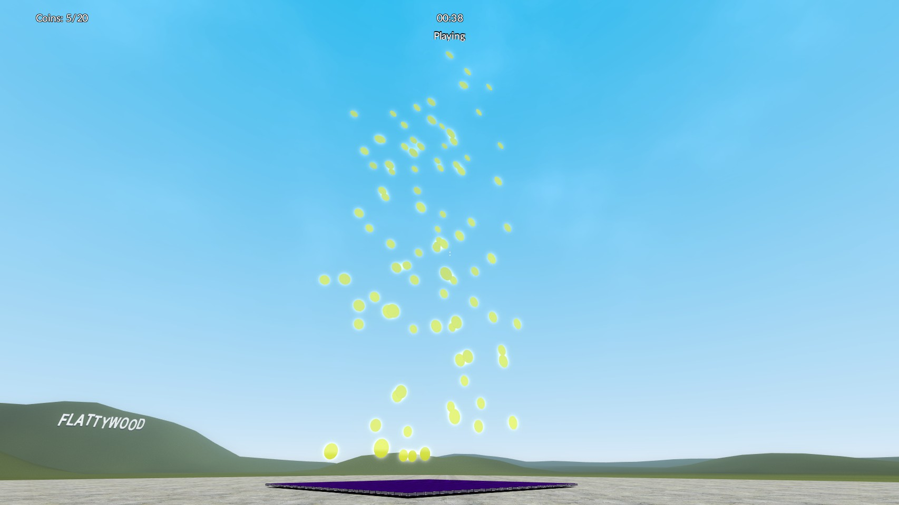

# Jumper
Gamemode for Garry's Mod where you jump on a trampoline and collect coins.

## Background
Jumper is a custom **Garry’s Mod gamemode** centered around vertical mobility and fast
paced, session-based gameplay. The core mechanic revolves around a dynamically spawned 
trampoline that launches players into the air, where they must collect coins distributed in 
vertical space.

The gamemode departs from traditional combat-oriented designs by eliminating player 
damage and fall damage entirely, focusing instead on movement precision, spatial 
awareness, and optimization of traversal paths. A structured round system governs 
gameplay flow, transitioning through waiting, active play, and end phases, with 
synchronized state management between server and clients.

The client-side experience is reinforced through a custom HUD that provides real-time 
feedback on critical metrics such as coin collection progress, remaining time, and round 
phase. The system is designed to be resolution-independent and reactive to display 
changes, ensuring consistent usability across environments.

## Description
Jumper is a custom **Garry’s Mod gamemode** focused on vertical traversal and score-based 
competition. Players are spawned onto a central trampoline that propels them upward, 
where they must collect coins distributed in the airspace above.

The gameplay is organized into timed rounds with clearly defined phases: waiting, active 
play, and end. During the active phase, players compete to collect the highest number of 
coins before time expires. At the end of each round, the player with the highest score is set 
as the winner, and the map resets.

The gamemode removes traditional combat mechanics, instead emphasizing movement 
precision, timing, and spatial optimization. A custom HUD provides real-time feedback on 
player progress, time remaining, and round state

## Features and Functionalities
### Core Gameplay
- Physics-based vertical movement using a trampoline entity 
- Coin collection system with per-player tracking via networked variables 
- Score-based win condition (highest coin count) 
### Round System
- Multi-phase round lifecycle: 
- Waiting phase (preparation) 
- Playing phase (active gameplay) 
- End phase (result + reset) 
- Server-authoritative round state with client synchronization 
- Automatic timer countdown and phase transitions 
### Player Management
- Automatic player spawning and positioning on the trampoline 
- Uniform player model and visual setup 
- Disabled damage systems: 
- No fall damage 
- No player-to-player damage 
### HUD & UI
- Custom crosshair 
- Real-time coin counter (current / total) 
- Countdown timer (mm:ss format) 
- Current round phase display 
- Resolution-independent UI scaling with dynamic font recreation 
### Entity System
- Dynamic spawning of: 
- Trampoline entity (central gameplay object) 
- Coin entities (distributed vertically) 
- Map-driven configuration for: 
- Coin count 
- Trampoline position 
### Networking
- Lightweight networking using custom messages (jmp_RoundState) 
- Synchronization of: 
- Remaining time 
- Current phase 
- Client-side prediction of timer progression

## Software & Hardware Requirements
### Software Requirements
- Garry’s Mod (latest version) 
- Steam client (running Garry’s Mod) 
- A compatible operating system: 
	- Windows 10/11 
	- Linux (Proton/native support) 
### Server Requirements (for hosting)
- Garry’s Mod dedicated server 
- Lua execution environment (included with GMod) 
- Basic configuration of gamemode files and map support 
### Hardware Requirements
**Minimum**
- CPU: Dual-core processor (2.0 GHz or higher) 
- RAM: 4 GB 
- GPU: DirectX 9 compatible 
- Storage: ~5–10 GB free space

**Recommended**
- CPU: Quad-core processor (3.0 GHz+) 
- RAM: 8 GB or more 
- GPU: Dedicated graphics card (for stable FPS during physics interactions) 
- Stable internet connection (for multiplayer synchronization)